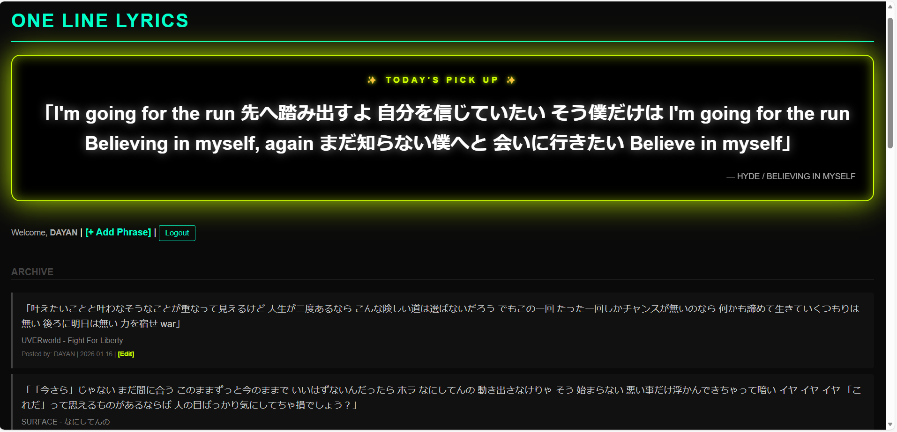
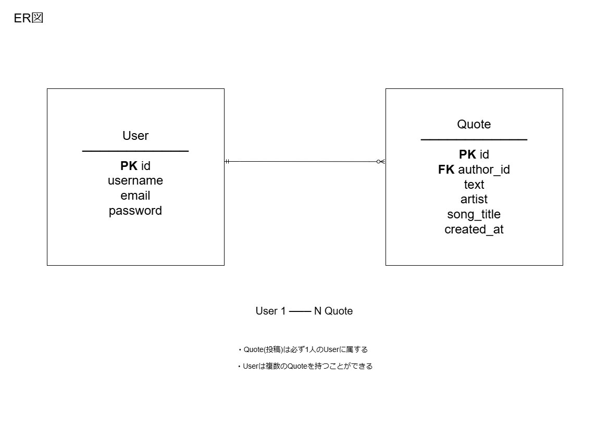
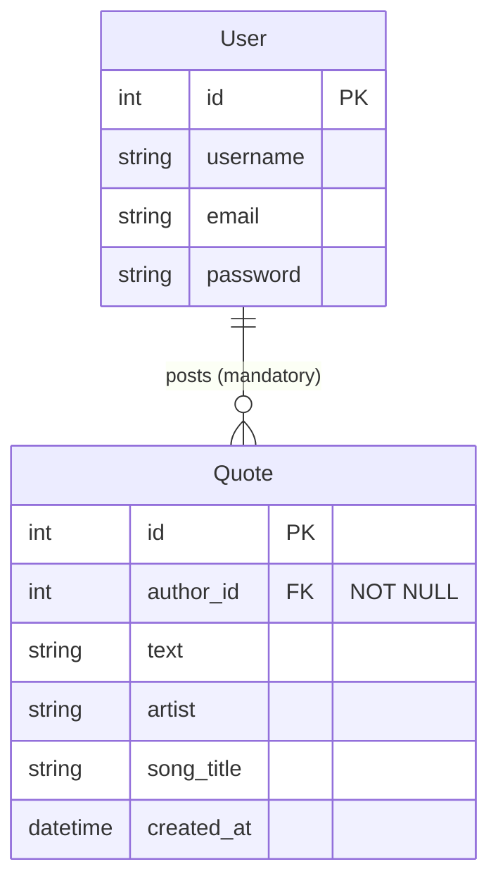

# One Line Lyrics
「心に刺さる、一行・ワンフレーズ」 
自分の中の「推し歌詞」をコレクション・共有するWebアプリです。

## Screenshots
### Top / Quote List Page

ログインユーザー向けトップ画面です。 
自身が投稿したフレーズを一覧で確認でき、新規追加・編集・削除といった CRUD 操作が可能です。 

※ 未ログイン時は、投稿の閲覧のみ可能、編集・追加ボタンは表示されません。

## 開発の背景
音楽を聴いている中で、曲全体だけでなく「特にこの一行に救われた」と感じる瞬間があります。 
そんな自分にとって特別なフレーズを記録し、共有できる場所を作りたいと考え、開発しました。

## 実装機能
- **ユーザー認証**: 登録・ログイン・ログアウト機能  
- **歌詞管理 (CRUD)**: ログインユーザーのみ投稿可能。投稿の閲覧・新規作成・編集・削除を行えるCRUD機能を実装  
- **権限制御**: 他ユーザーの投稿は編集・削除不可、自分の投稿のみ操作可能  
- **マイページ機能**: ログインユーザー自身の投稿のみを一覧表示し、編集・削除ボタンを表示  
- **レスポンシブデザイン**: スマートフォンからの閲覧にも対応

## テストについて
本アプリでは、表示確認だけでなく**認証・権限制御・データ整合性**まで含めたテストを実装しています。

- 未ログイン時のアクセス制御（リダイレクト確認）
- 他ユーザーによる編集・削除の拒否（403 / 404）
- 不正操作時に DBが書き換わらないこと の検証
- 自分の投稿は正しく編集できること(成功系)
 
※ 詳細なテスト設計方針は後述

## 使用技術
### バックエンド
- **Python 3.x** / **Django**:標準でユーザー認証や権限制御の仕組みが整っており、拡張性の高いWebアプリを構築できる点を重視して採用しました。
### フロントエンド
- **HTML5 / CSS3**: ネオン感のあるデザインを表現するため、CSSカスタムプロパティを活用しています。
### ツール
- **Git / GitHub**: バージョン管理
- **VS Code**: 開発エディタ

## 開発のこだわり
- **直感的な管理画面**: verbose_name を設定し、管理画面や入力フォームのラベルを日本語化しました。 
開発者・運用者が直感的に操作できる構成を意識しています。
- **データ整合性を意識した設計**: on_delete=models.CASCADE を採用し、ユーザー削除時に関連する投稿も連動して削除されるよう設計しました。 
データベースに不要なデータが残らない構成を意識しています。

## デザインのこだわり
- **ライブ会場を連想するUI**: 背景を漆黒に設定し、box-shadow を活用した光彩エフェクトで、モニター越しでもライブ照明のような奥行きを感じられるデザインを目指しました。

## 苦労した点・学んだこと
- **ユーザーごとの権限制御**: ログインユーザーと投稿データを紐付け、他ユーザーの投稿は編集・削除できないよう制御する実装に苦労しました。 
この実装を通じて、Djangoにおけるモデル間のリレーションや、ビュー・テンプレート双方での権限チェックの重要性を理解しました。
- **認証状態に応じた画面制御**: 未ログインユーザーには投稿機能を表示せず、ログイン後のみ操作可能とすることで、不正操作を防ぐ設計を行いました。 
認証情報をもとにUIを制御することで、セキュリティとユーザー体験の両立を意識するようになりました。
- **CSSによるデザイン調整**: ネオン感のあるデザインを表現するため box-shadow や色の透過度、ぼかしの範囲を細かく調整しました。 
見た目の演出だけでなく、文字の可読性や操作性を損なわないバランスを考える重要性を学びました。

## 今後のアップデート予定
- Spotify APIとの連携（投稿時に曲名やアーティスト名を自動補完、正確なデータ登録をサポート）
- いいね機能の追加（共感したフレーズにワンタップで反応できる仕組みの導入）
- コメント機能の実装（歌詞の解釈をユーザー同士で語り合えるコミュニティ要素の追加）

## デプロイ・運用に関する補足
- 環境構築と公開について、本アプリは現在ローカル環境での動作を確認済みです。
- SECRET_KEY 等の機密情報は環境変数で管理し、GitHub上に秘匿情報が残らないよう settings.py から分離しています。
- 今後は AWS や Render 等へのデプロイを通じ、本番環境におけるパフォーマンスの最適化や静的ファイルの配信管理を学習する予定です。

## ER図

  

本ER図は、テーブル構造やリレーションが他の開発者にも直感的に伝わるよう、
実務で広く採用されている IE（Information Engineering）記法を用いて作成しています。 
User と Quote は 1対多の関係で、1人のユーザーが複数の歌詞投稿を持つ設計としています。
Quote.author_id は NOT NULL とし、すべての投稿は必ず User に紐づくよう制約を設けています。 

※ User は Django 標準の認証機構（AbstractUser）を前提としており、password は Django によりハッシュ化されて保存されます。

### ER図（Mermaid）

※ Mermaid では IE記法の必須／任意関係を完全には表現できないため、必須制約（NOT NULL）や業務ルールは属性コメントおよび文章で補足しています。

 テスト設計方針 

本アプリでは、「画面が表示されるか」だけでなく、認証・権限・データ整合性まで含めて保証することを目的にテストを設計しています。

1. 基本方針

Django の TestCase を使用し、実際のリクエスト／レスポンスを想定したテストを実施

View 単体ではなく、URL → View → DB までを通した振る舞いを検証

成功系だけでなく、不正操作(他人のデータ操作)を防げているかを重視

2. 一覧・表示系のテスト

トップページ(一覧画面)が正常に表示されること（HTTP 200）

正しいテンプレートが使用されていること

データベースに保存された投稿が画面に表示されること

3. 認証(ログイン)に関するテスト

未ログインユーザーが投稿作成ページにアクセスした場合
→ ログイン画面へリダイレクトされること

next パラメータを含め、ログイン後に元のページへ戻れる導線も検証

UX とセキュリティの両立を意識

4. 権限制御(他人の投稿操作防止)

以下の不正操作を想定し、GET / POST / DELETE の全てをテストしています。

他ユーザーの投稿編集ページへのアクセス

POST リクエストによる不正な編集試行

他ユーザーの投稿削除試行

これらの操作に対しては、403 Forbidden または 404 Not Found（存在を隠す設計）のいずれかが返ることを許容し、設計変更に強いテストとしています。
また、レスポンスだけでなくデータベースの内容が書き換わっていないことも必ず確認しています。

5. 成功系(正しい操作)のテスト

ログインユーザーが自分の投稿を編集できること

POST 後、データベースに変更が正しく反映されていること

「拒否できる」だけでなく「正しく更新できる」ことまで保証

6. このテスト設計で意識していること

セキュリティ(他人のデータを守る)

実務で起こり得る不正操作の想定

将来的な仕様変更（403 ⇄ 404）に耐えられる柔軟性

